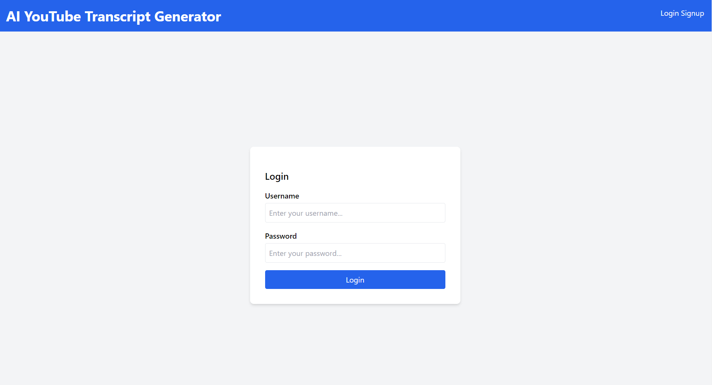
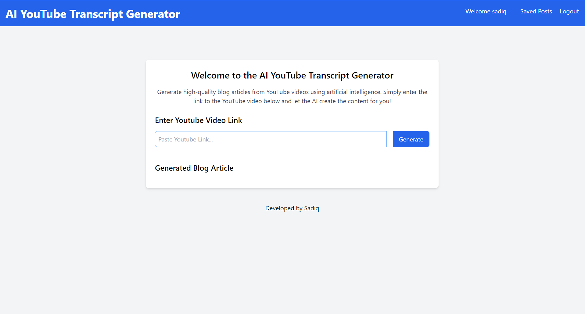
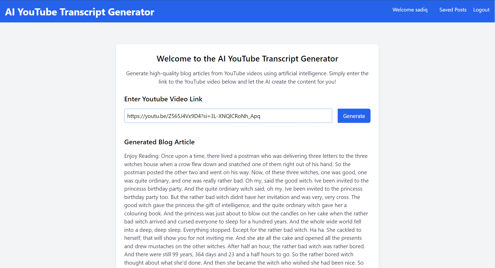
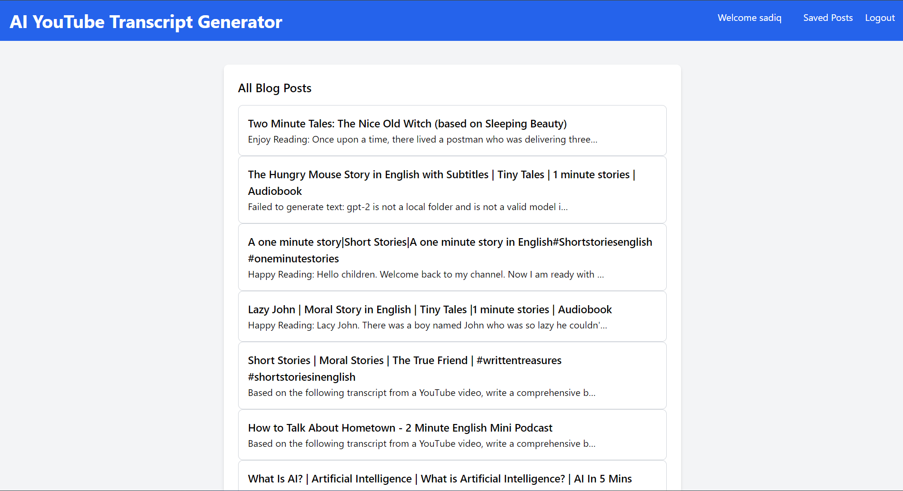

**YouTube-AI-Transcript-Generator**

Youtube-AI-Transcript-generator is a project which takes an youtube url and generates the transcript of the given url video.
In this project i have used gpt-2 models to transform the extracted text from the youtube video using url to generate a more readable format.
We can use chatGPT API for generating the text into a better format and can change whatever format we want by changing the prompt.
This will help greatly for the students to get the important points from the video by simply providing the url instead of listening the entire video and also where time matters.

__Screenshots__

