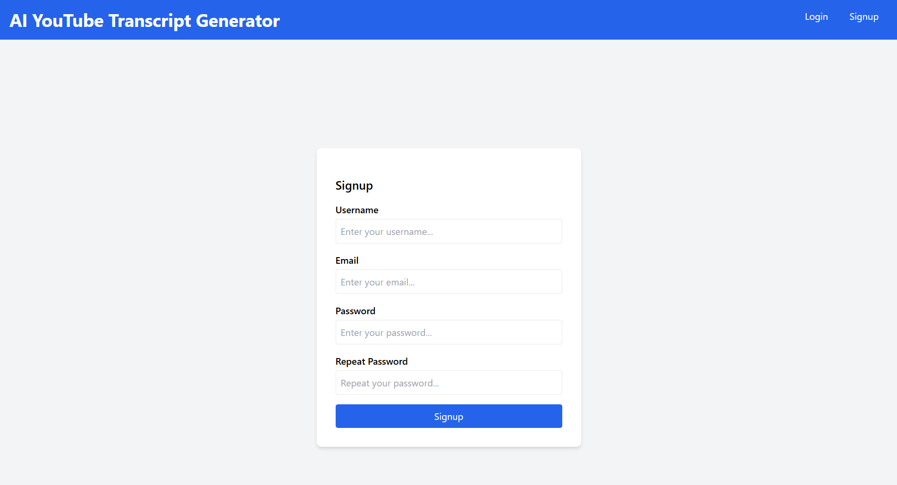
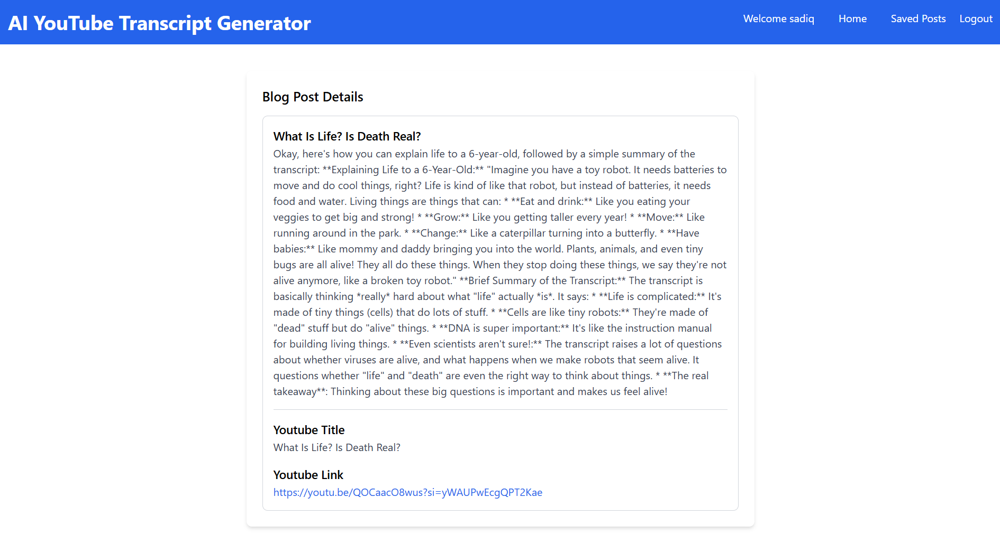

# YouTube-AI-Transcript-Generator

Youtube-AI-Transcript-generator is a project build using Django framework and integrated Google AI Studio API to generate text. This project has two inputs, a youtube url and a dynamic prompt to determine respective generative text. This application is usefull in the cases where we need to extract important information of a youtube video and re-transform it to our specific purposes.

# Screenshots

